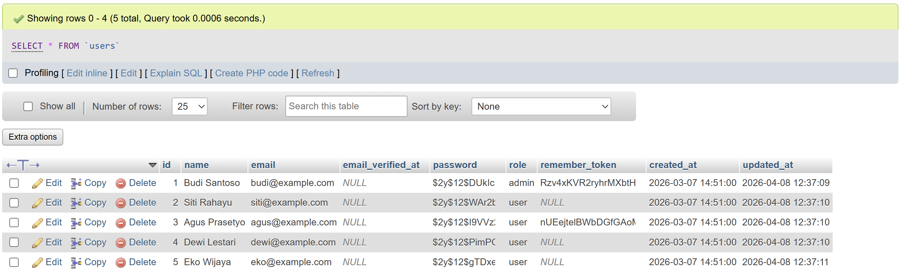
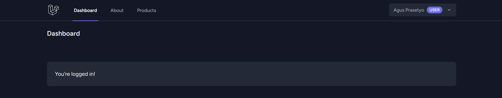
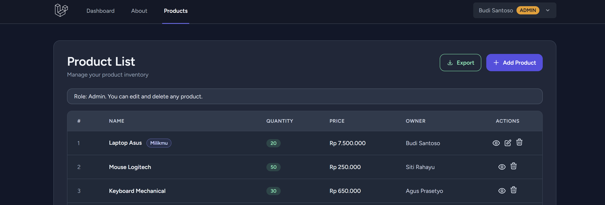
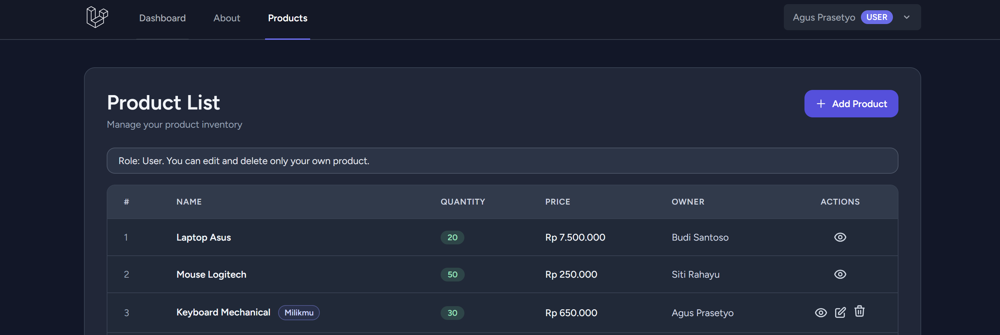
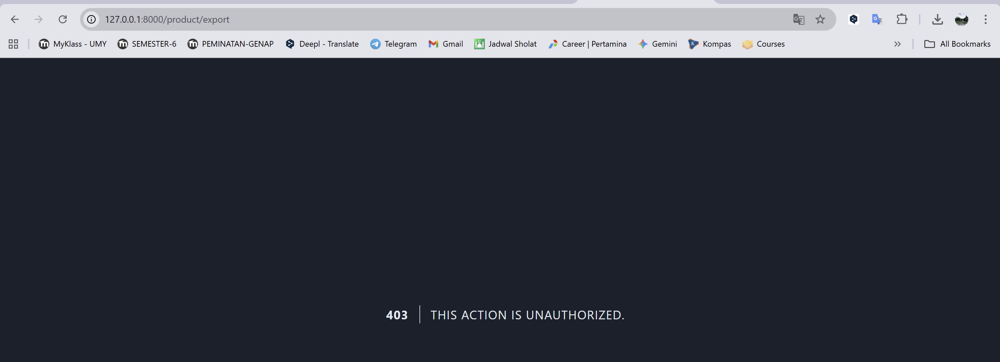
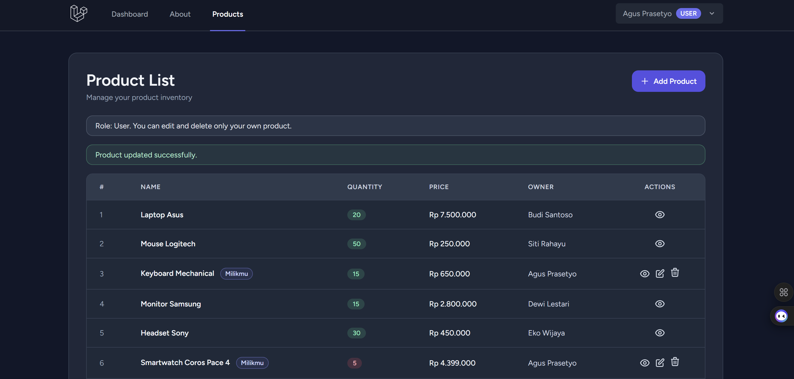
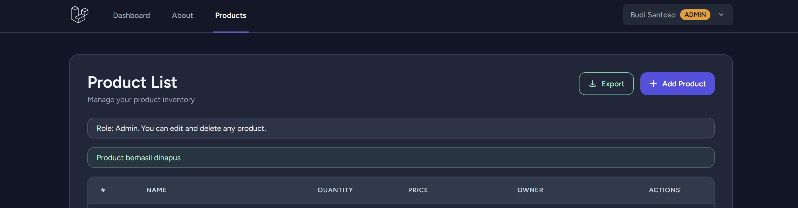
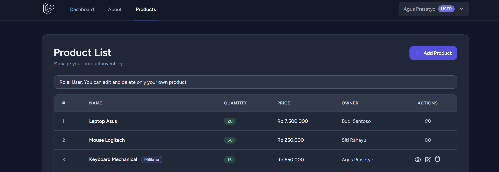
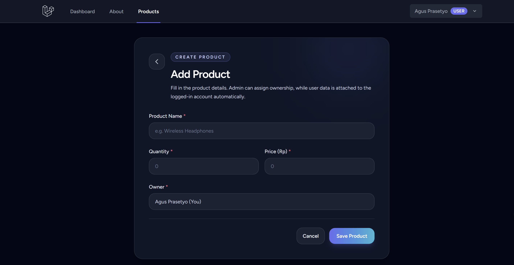
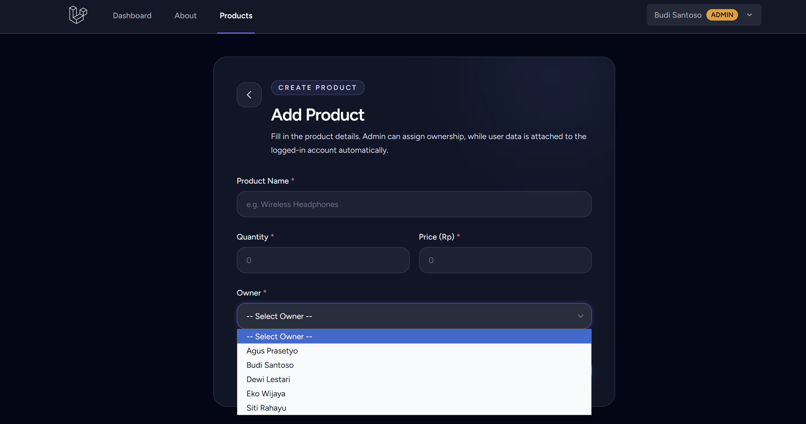

# TUGAS WEEK 5 - Otorisasi Laravel (Role, Gate, Policy)

- 
  Bukti kolom `role` di tabel `users` dan ada minimal 1 akun `admin`.
  Saran ambil dari phpMyAdmin (table users) atau data list users.

- 
  Login sebagai admin, tampilkan badge/teks role di navbar.

- 
  Login sebagai user biasa, tampilkan badge/teks role di navbar.

- 
  Halaman product saat login admin, tombol Export terlihat.

- 
  Halaman product saat login user, tombol Export tidak terlihat.

- 
  User akses URL export langsung (`/product/export`) dan ditolak (403/unauthorized).

- 
  User mengedit produk miliknya sendiri dan berhasil.

- 
  Admin menghapus produk milik user lain dan berhasil.

- 
  User hanya melihat tombol delete pada produk miliknya, tidak pada produk orang lain.

- 
  Form create saat login user: owner terkunci ke diri sendiri (tidak bisa pilih user lain).

- 
  Form create saat login admin: owner bisa dipilih.