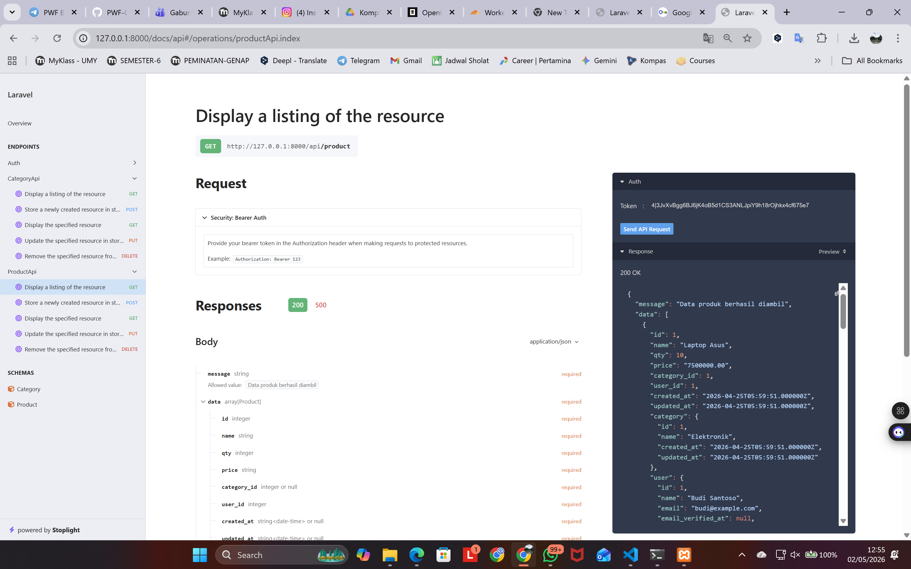
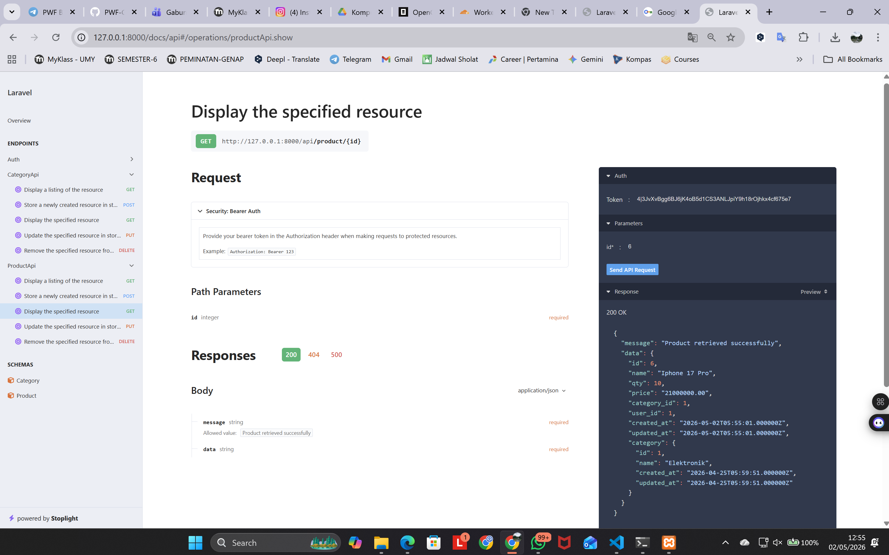
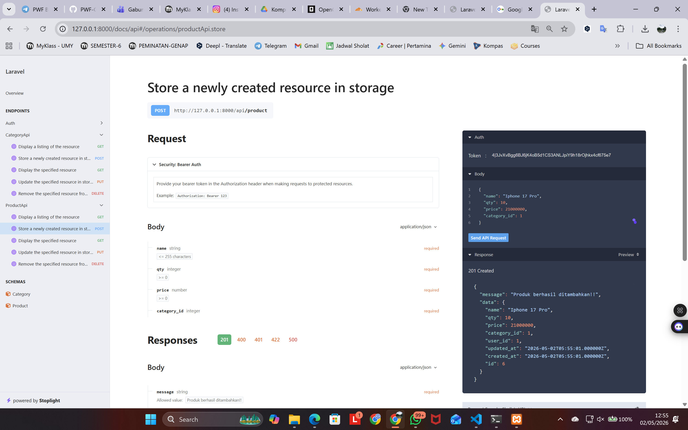
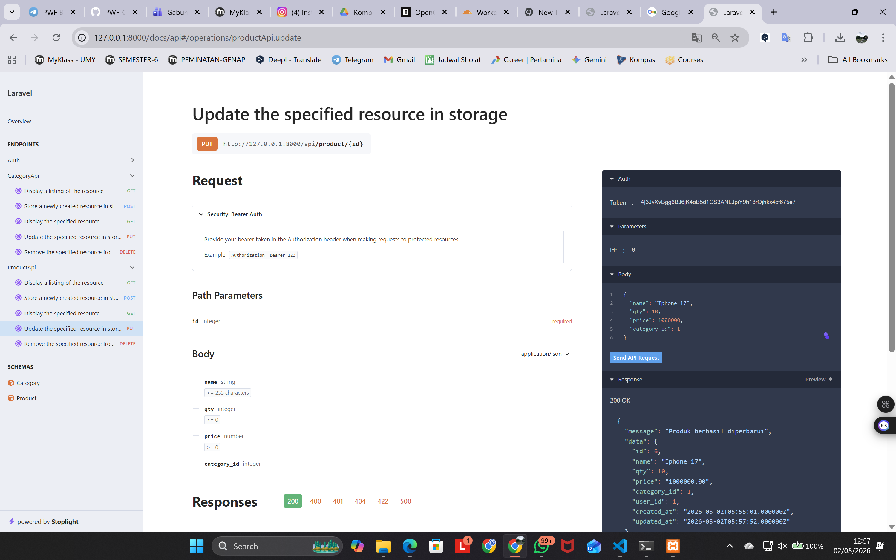
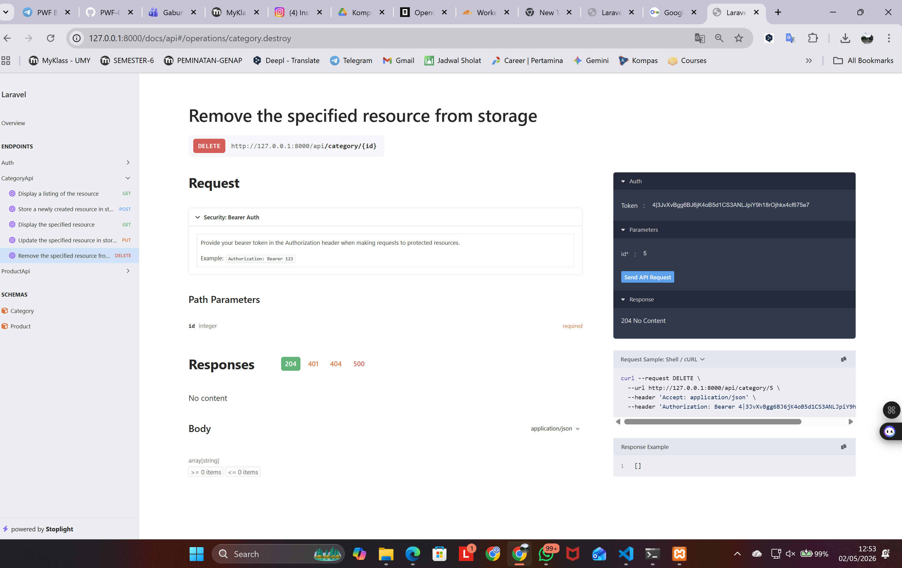
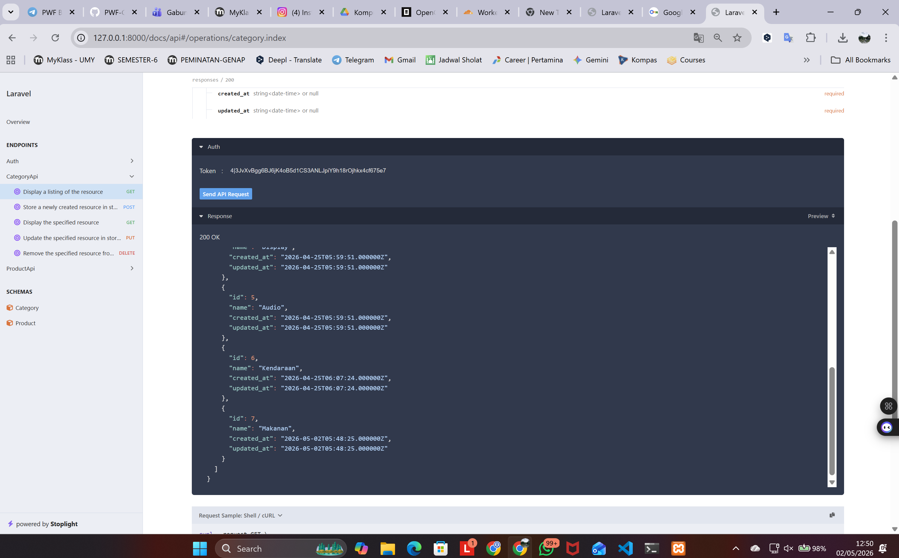
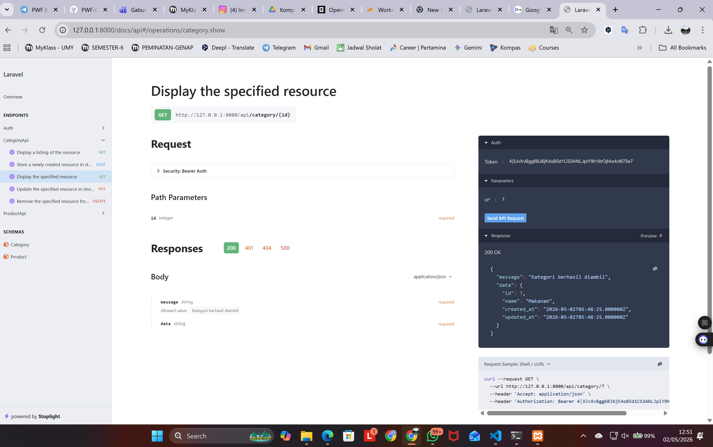
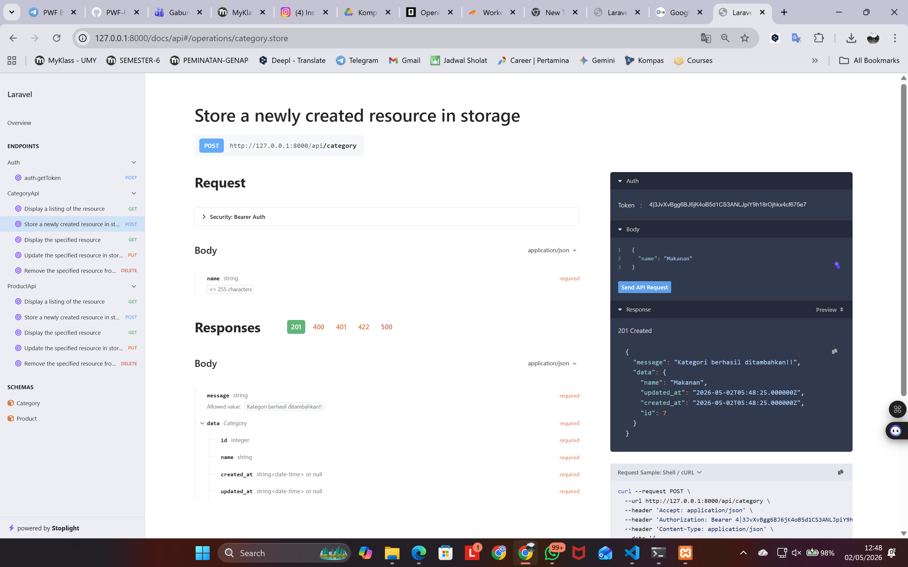
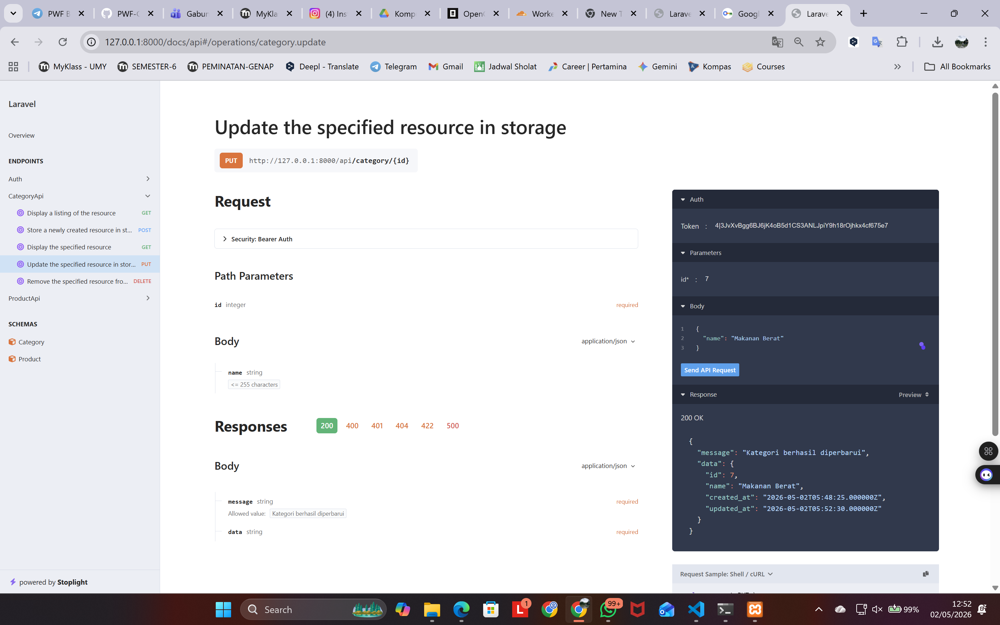
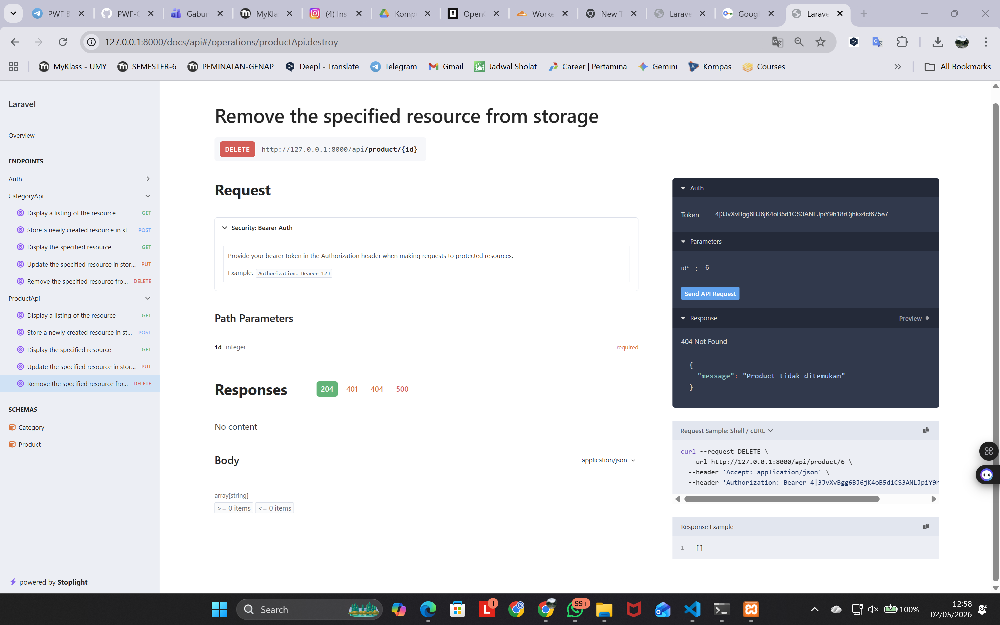

# Week 9 - Dokumentasi API

## Product API

### GET All Product

### GET Specific Product

### POST Product

### PUT Product

### DELETE Category

## Category API

### GET All Category

### GET Specific Category

### POST Category

### PUT Category

### DELETE Product

